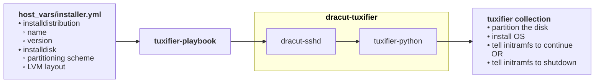

# tuxifier-playbook
This repository can be used to demonstrate the tuxifier collection for bare-metal installation of servers

Documentation:
* For a broad overview of Tuxifier, see [introduction](docs/introduction.md).
* For the architecture of Tuxifier, see [architecture](docs/architecture.md)

Below a schematic representation of how the different parts of tuxifier work together.

## Quick-start
_This quick start assumes that you are using virt-manager._

For demonstration purposes there are initramfs images available for:
* rocky8
* rocky9
* rocky10

With each of them an installation of either supplied version can be performed. For other versions, they'll have to be added.<br>
The version used only makes a difference when the `continue_install` host variable is set to `true`. In that case the kernel version used needs to be available for the target installation.<br>
For example, the Rocky Linux 9 initramfs can install any supported target when continue_install is false. When it is true, the target repository must provide the exact running kernel package.<br>
Therefore, this image can continue booting only a compatible EL9 target whose repository contains kernel-core-5.14.0-687.42.1.el9_8.x86_64.


The three initramfs and vmlinuz images available:
* [ansible-tuxifier-initramfs-4.18.0-553.155.1.el8_10.x86_64.img](https://verweggistan.eu/ansible-tuxifier-initramfs-4.18.0-553.155.1.el8_10.x86_64.img) & [vmlinuz-4.18.0-553.155.1.el8_10.x86_64](https://verweggistan.eu/vmlinuz-4.18.0-553.155.1.el8_10.x86_64)
* [ansible-tuxifier-initramfs-5.14.0-687.42.1.el9_8.x86_64.img](https://verweggistan.eu/ansible-tuxifier-initramfs-5.14.0-687.42.1.el9_8.x86_64.img) & [vmlinuz-5.14.0-687.42.1.el9_8.x86_64](https://verweggistan.eu/vmlinuz-5.14.0-687.42.1.el9_8.x86_64)
* [ansible-tuxifier-initramfs-6.12.0-211.44.1.el10_2.x86_64.img](https://verweggistan.eu/ansible-tuxifier-initramfs-6.12.0-211.44.1.el10_2.x86_64.img) & [vmlinuz-6.12.0-211.44.1.el10_2.x86_64](https://verweggistan.eu/vmlinuz-6.12.0-211.44.1.el10_2.x86_64)

The ssh private and public key required to access these initramfs images are available from:
* [id-tuxifier_ed25519](https://verweggistan.eu/id-tuxifier_ed25519)
* [id-tuxifier_ed25519.pub](https://verweggistan.eu/id-tuxifier_ed25519.pub)
>[!CAUTION]
>The demonstration private key is publicly available and is also installed in the target system. Anyone with network access to the machine can authenticate as root. Use these images only with disposable virtual machines on an isolated network, and replace or remove the key before exposing the system to another network.

### Creation of a virtual machine

Define a new virtual machine using virt-manager. An existing virtual machine can be used as well, but the disk will be destroyed.

In the `hardware details` of the virtual machine choose `Boot options` and enable the **Direct kernel boot** option.<br>
For the `kernel path:` and `Initrd path:` choose either of the three combinations of initramfs images and vmlinuz images. _But obviously of the same version._

For the `Kernel args` fill the following:
```
rd.neednet=1 root=LABEL=root enforcing=0 console=tty0 console=ttyS0
```
_Except for the `console` options, All options except the console arguments are required. Set root to the root file system that the newly installed system will use._

Starting the virtual machine should repeatedly display:<br>
`00:00:07: Waiting for Ansible;`

That indicates the ram disk a ready for Ansible instructions.
### Installation of the tuxifier Ansible collection

To install the `tuxifier` collection, issue the following `ansible-galaxy` command:
```sh
ansible-galaxy collection install git+https://github.com/Geertsky/tuxifier.git
```

### Define the host variables for the target installation

In this repository there are a number of example target installations defined (see [inventory/host_vars](inventory/host_vars)).

This quick-start assumes the hostname for the target is either `installer-bios` or `installer-uefi`

```sh
cd inventory/host_vars/
ln -s rocky9-bios.yml installer-bios.yml
# For UEFI instead:
# ln -s rocky9-uefi.yml installer-uefi.yml
cd ../../
```

>[!IMPORTANT]
>The example host variables assume that the virtual machine has a VirtIO disk. The first VirtIO disk normally appears as `/dev/vda`, so the examples set `installdisk.disks[0].device` to `/dev/vda`. Change this value if the installation disk uses another device path.

### Starting the playbook

```sh
ansible-playbook -l installer-bios playbook.yml
```
> [!WARNING]
> This playbook will destroy the installation disk without further warning!
