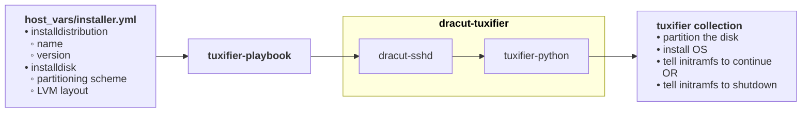

# tuxifier-playbook
This repository can be used to demonstrate the tuxifier collection for bare-metal install  of servers

Below a schematic representation of how the different parts of tuxifier work together.

## quick-start
_This quick-start assumes usage of virt-manager_

For demonstration purposes there are initrd images available for the latest kernel, as of this writing, for:
* rocky8
* rocky9
* rocky10

With each of them an installation of either version can be performed.<br>
The version used only makes a difference when the `continue_install` host_var option is set to `True`. In that case the kernel version used needs to be available for the target installation.<br>
So, the rocky9 initrd image can be used to install either target when `continue_install` is set to `False`. <br>
When however the host_vars `continue_install` is set to `True`, then the rocky9 initrd can only be used for rocky9 installation or alma9 installation as only those repositories contain a `kernel-core-5.14.0-687.42.1.el9_8.x86_64` package.<br>

The three initrd and vmlinux images available:
* [ansible-tuxifier-initramfs-4.18.0-553.155.1.el8_10.x86_64.img](https://verweggistan.eu/ansible-tuxifier-initramfs-4.18.0-553.155.1.el8_10.x86_64.img) & [vmlinuz-4.18.0-553.155.1.el8_10.x86_64](https://verweggistan.eu/vmlinuz-4.18.0-553.155.1.el8_10.x86_64)
* [ansible-tuxifier-initramfs-5.14.0-687.42.1.el9_8.x86_64.img](https://verweggistan.eu/ansible-tuxifier-initramfs-5.14.0-687.42.1.el9_8.x86_64.img) & [vmlinuz-5.14.0-687.42.1.el9_8.x86_64](https://verweggistan.eu/vmlinuz-5.14.0-687.42.1.el9_8.x86_64)
* [ansible-tuxifier-initramfs-6.12.0-211.44.1.el10_2.x86_64.img](https://verweggistan.eu/ansible-tuxifier-initramfs-6.12.0-211.44.1.el10_2.x86_64.img) & [vmlinuz-6.12.0-211.44.1.el10_2.x86_64](https://verweggistan.eu/vmlinuz-6.12.0-211.44.1.el10_2.x86_64)

The ssh private and public key required to access these initrd images are availabel from:
* [id-tuxifier_ed25519](https://verweggistan.eu/id-tuxifier_ed25519)
* [id-tuxifier_ed25519.pub](https://verweggistan.eu/id-tuxifier_ed25519.pub)
>[!CAUTION]
>As this ssh-key get's installed in the target machine as well, it is adviced to use the initrd images for demonstration purposes only!!

### Creation of a virtual machine

Define a new virtual machine using virt-manager. An existing can be used as well but the disk will be destroyed.

In the `hardware details` of the virtual machine choose `Boot options` and enable the **Direct kernel boot** option.<br>
For the `kernel path:` and `Initrd path:` choose either of the three combinations of initrd images and vmlinuz images. _buth obviously of the same version._

For the `Kernel args` fill the following: `rd.neednet=1 root=LABEL=root enforcing=0 console=tty0 console=ttyS0`<br>
_Except for the `console` options, they are mandatory._

Starting the virtual machine should en in repetitively showing: <br>
`00:00:07: Waiting for Ansible;`

That indicates the ramdisk a ready for ansible instructions.
### Installation of the tuxifier ansible collection

```sh
ansible-galaxy collection install git+https://github.com/Geertsky/tuxifier.git
```

### Define the host_vars for the target installation

In this repository there are a number of example target installations defined.

For this quick-start I assume the hostname for the target is either `installer-bios` or `installer-uefi`

```sh
cd inventory/host_vars/
ln -s rocky9-bios.yml installer-bios.yml
cd ../../
```
>[!IMPORTANT]
>The `host_vars` presumes a `VirtIO` type disk is added to the virtual machine. The first `VirtIO` disk apears as `/dev/vda`. The host_vars are set have `installdisk.disks[0].device` set to `/dev/vda`. Modify when required.

### Starting the playbook

```sh
ansible-playbook -l installer-bios playbook.yml
```
> [!WARNING]
> This playbook will destroy the installation disk without further warning!
