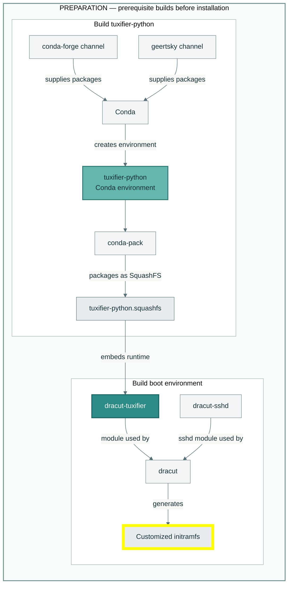
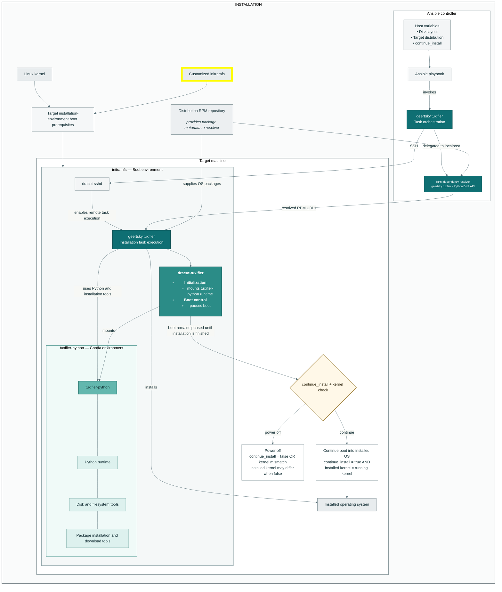

<!-- LTeX: dictionary+=tuxifier dictionary+=Tuxifier dictionary+=libblockdev dictionary+=dracut -->
# Architecture

Tuxifier is made up of different projects. These projects are:

- [Tuxifier playbook](https://github.com/tuxifier-playbook)

- [Tuxifier tasks collection](https://github.com/Geertsky/tuxifier)

- [Tuxifier-runtime](https://github.com/Geertsky/tuxifier-python)

- [Tuxifier boot](https://github.com/Geertsky/dracut-tuxifier)

## Tuxifier playbook

The tuxifier playbook is just a simple playbook that imports the `ansible_tuxifier` role of the Tuxifier tasks collection.

## Tuxifier tasks collection

At the heart of Tuxifier is the Tuxifier tasks collection. The Tuxifier tasks collection consists of the tasks to partition a disk and install an OS on it.

## Tuxifier-runtime

Tuxifier-runtime is a runtime environment that is completely independent and portable. 
The Tuxifier-runtime environment is an additional layer on top of the OS that enables the execution of the tasks specified in the Tuxifier tasks collection.
For the Tuxifier-runtime, a [conda Python environment](https://docs.conda.io/projects/conda/en/stable/) is built. The Tuxifier-runtime consists of:

- Python
- Basic Linux tools
- Partitioning tools

## Tuxifier boot

Tuxifier boot creates a boot environment with an ssh server and with the Tuxifier-runtime environment included.
This makes it possible for the Tuxifier tasks collection to be executed at boot time.

# Tuxifier execution flow

Tuxifier boot basically pauses execution just before the root file system with the installation gets accessed.
This happens really early, within the first seconds, when you boot your server.

At that point, the Tuxifier tasks collection, executed on a different control server, partitions the disk and installs an OS onto it.
Finally, it triggers continuation of the boot process which either boots the target machine to the just installed operating system, or powers off the target machine.
# Components and Relationships

## Preparation

## Installation

