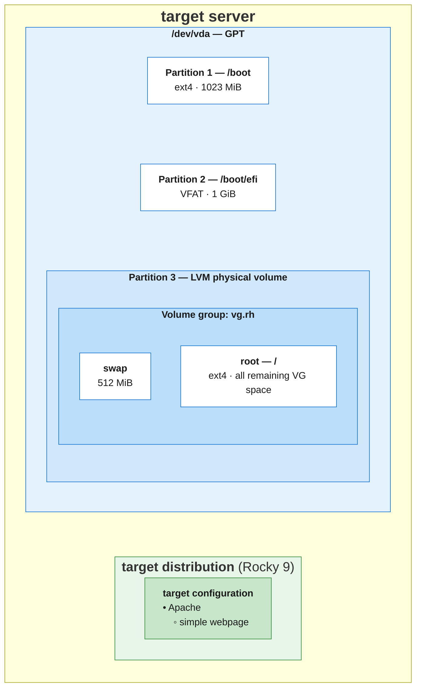

# Tuxifier introduction

Setting up a server involves two distinct processes: installing the operating system and configuring the server to its desired state. Each process can use different tools and methods, and the choices made for one do not necessarily dictate those made for the other.

Tuxifier integrates these processes into a single installation workflow. You define the desired state of the server—including its partition layout, OS release, software, and configuration—in one place. Tuxifier then uses those definitions to install and configure the server.

This document introduces an example target system, explains the two underlying processes, and describes how Tuxifier combines them.

## The target system
*For this document, we define a target. The target for this document is a Rocky server with a web server installed and an example webpage served.*

_Examples of how these definitions can look for a server can be found in [host_vars/](../inventory/host_vars/)._

# The problem - two orthogonal processes

To install a server to its final state, two completely independent processes are always needed:

1. Install a server with a minimal OS

2. Install and configure the server to its final state

## Step 1

For **step 1**, the following parameters have to be defined:

1. Partition layout

2. OS release

For **step 1**, we can choose different solutions. For example:

- A Kickstart file for partitioning and installation

- A clone of an existing image (only works for a virtual server)

After **step 1**, we have a minimally installed system with which we effectively cannot do anything. We can boot the system and log in to it, but that is pretty much it. Its intended purpose still needs to be realized.

However, some crucial, partly irreversible decisions have already been made:

- The partition layout of the system *(costly or disruptive to change)*

- The OS release installed *(partly modifiable)*

## Step 2

In **step 2**, we can install additional software and configure the system to a final target state.

For **step 2**, the parameters are *(for the target system above)*:

1. Web server *(Apache, Nginx, ...)*

2. Webpage

For **step 2**, we can also choose different solutions:

- Manual installation/configuration

- Scripted installation/configuration

- Ansible

- Terraform

- ...

Regardless of which choices we make, the two processes remain orthogonal.

# The solution - one unified installation process - Tuxifier

Tuxifier combines these two steps into one.

That means we can define all the parameters in one place, use one tool, and simply say: **Make it so!**

# How does Tuxifier work?

Tuxifier is made up of different parts. These parts are:

- Tuxifier tasks collection

- Tuxifier runtime

- Tuxifier boot

## Tuxifier tasks collection

At the heart of Tuxifier is the Tuxifier tasks collection. The Tuxifier tasks collection consists of the tasks to partition a disk and install an OS on it.

## Tuxifier-runtime

Tuxifier runtime is a runtime environment that is completely independent and portable. 
For the Tuxifier-runtime, a [conda Python environment](https://docs.conda.io/projects/conda/en/stable/) is built. The Tuxifier-runtime consists of:

- Python
- Basic Linux tools
- Partitioning tools

## Tuxifier boot

Tuxifier boot creates a boot-time environment with the Tuxifier-runtime included. This makes it possible for the Tuxifier tasks collection to be executed at boot time.

# Tuxifier execution

Tuxifier boot basically pauses execution just before the root filesystem with the installation gets accessed. This happens really early, within the first seconds, when you boot your server.

At that point, the Tuxifier tasks collection, executed on a different control server, partitions the disk and installs an OS onto it. Finally, it triggers continuation of the boot process.

# Conclusion

This makes it possible to:

- Define all parameters for the final state of a server.
- Boot a server on which an OS may never have been installed.
- End up with a server that matches the requirements specified in the parameters file.
